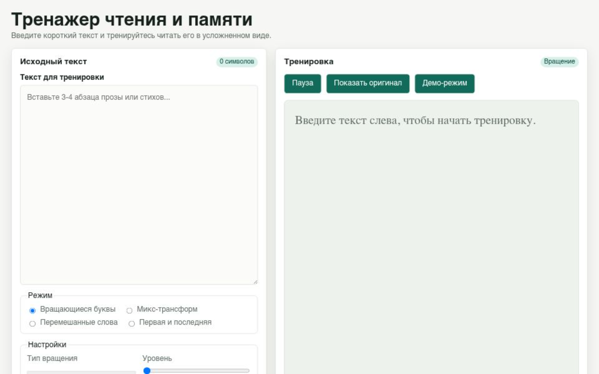

# Тренажер чтения и развития памяти

Статический веб-тренажер для развития скорости чтения, концентрации и зрительной памяти. Пользователь вводит короткий текст, выбирает режим усложнения и тренируется читать тот же материал в измененном визуальном представлении.

Проект сделан как легкое приложение без сборки: HTML, CSS и JavaScript ES-модули. Локальный Node.js-сервер нужен только для разработки и корректной отдачи модулей в браузере.

## Демонстрация



<video src="docs/video.mp4" controls width="100%" title="Демонстрация работы тренажера"></video>

Если платформа просмотра README не показывает встроенное видео, откройте файл [docs/video.mp4](docs/video.mp4) напрямую.

## Возможности

- ввод короткого пользовательского текста для тренировки;
- режим вращающихся букв с плавным или дискретным вращением;
- режим `Микс-трансформ`, где буквы получают разные визуальные трансформации;
- перемешивание букв внутри слов с сохранением первой буквы;
- перемешивание букв внутри слов с сохранением первой и последней буквы;
- настройка уровня сложности, скорости и времени временного показа оригинала;
- пауза без сброса введенного текста;
- временное отображение исходного текста;
- полноэкранный демо-режим с выходом по `Esc`;
- автоматические тесты для ключевой логики.

## Быстрый старт

Требования:

- Node.js;
- npm;
- современный браузер.

Установка зависимостей:

```powershell
npm install
```

Запуск локального сервера:

```powershell
npm start
```

После запуска откройте:

```text
http://127.0.0.1:4173
```

Проверка тестов на Windows:

```powershell
npm.cmd test
```

## Как пользоваться

1. Вставьте или введите текст в левую область.
2. Выберите тренировочный режим.
3. Настройте уровень, скорость и длительность показа оригинала.
4. Читайте преобразованный текст в правой области.
5. Используйте `Пауза`, чтобы остановить движение.
6. Используйте `Показать оригинал`, чтобы на короткое время увидеть исходный текст.
7. Включите `Демо-режим`, если нужно вывести тренировку на весь экран.
8. Нажмите `Esc`, чтобы выйти из демо-режима.

## Деплой на Vercel

Проект можно опубликовать на Vercel как статический сайт. Сборка не требуется, потому что исходные файлы уже готовы к отдаче браузеру.

В репозитории есть `vercel.json`, который фиксирует настройки деплоя:

| Настройка | Значение |
| --- | --- |
| Framework Preset | `Other` |
| Build Command | отключен |
| Output Directory | `.` |
| Install Command | оставить авто или пустым |

Для автодеплоя:

1. Опубликуйте репозиторий на GitHub, GitLab или Bitbucket.
2. В Vercel выберите `Add New Project` и импортируйте этот репозиторий.
3. Проверьте, что Vercel видит `Framework Preset: Other`, `Build Command: None`, `Output Directory: .`.
4. Нажмите `Deploy`.
5. После подключения каждый push в основную ветку будет запускать production deployment, а pull request будет получать preview deployment.

`server.js` используется только для локальной разработки. На Vercel приложение отдается как набор статических файлов из корня проекта: `index.html`, `styles/`, `src/`, `docs/screenshot.png` и `docs/video.mp4`.

## Структура проекта

| Путь | Назначение |
| --- | --- |
| `index.html` | Основная разметка приложения. |
| `styles/` | Базовые стили, макет и визуальные эффекты тренировки. |
| `src/app.js` | Точка входа и инициализация приложения. |
| `src/state.js` | Состояние и валидация настроек. |
| `src/controls.js` | UI-события, кнопки, демо-режим и обработка `Esc`. |
| `src/renderer.js` | Отрисовка тренировочного текста. |
| `src/animation.js` | Параметры вращения и режима `Микс-трансформ`. |
| `src/text-transformer.js` | Алгоритмы перемешивания слов. |
| `src/logger.js` | Логирование без полного пользовательского текста. |
| `tests/` | Автоматические тесты. |
| `docs/` | Подробная документация и демонстрационное видео. |

## Документация

| Раздел | Описание |
| --- | --- |
| [Быстрый старт](docs/getting-started.md) | Установка, запуск и базовый сценарий использования. |
| [Режимы тренировки](docs/modes.md) | Подробное описание режимов и элементов управления. |
| [Архитектура](docs/architecture.md) | Структура модулей и поток данных. |
| [Тестирование](docs/testing.md) | Автоматические и ручные проверки. |
| [Журнал изменений](CHANGELOG.md) | История заметных изменений. |

## Технологии

- HTML5;
- CSS3;
- JavaScript ES-модули;
- Node.js test runner;
- локальный Node.js-сервер для разработки.
